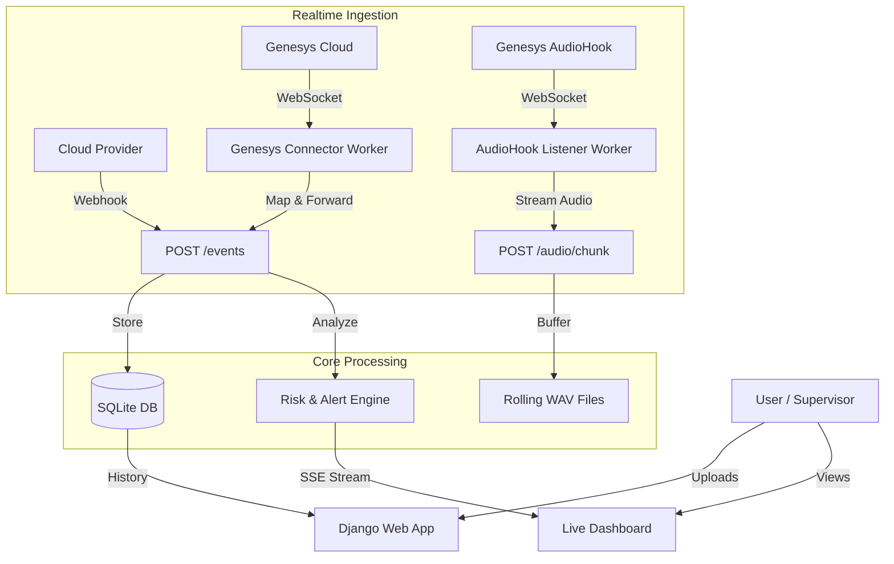

# Call Analytics Platform

call analytics platform built with Django.

It supports:
- **Batch call processing** (upload audio, transcript, analytics, summaries)
- **Realtime event ingestion** from cloud providers
- **Live supervisor alerts** (sentiment, escalation keywords, dead-air, risk)
- **Genesys Cloud connector** (OAuth, subscriptions, websocket stream, retries, health)
- **Genesys AudioHook listener** (listen-only dual-party call audio ingest)
- **Automated deployment scripts** for Linux and Windows

Companion Word guide:
- [`./Call_Analytics_Implementation_Guide.docx`](./Call_Analytics_Implementation_Guide.docx)

## Table of Contents
- [1. Product Overview](#1-product-overview)
- [2. Core Capabilities](#2-core-capabilities)
- [3. Architecture](#3-architecture)
- [4. Repository Layout](#4-repository-layout)
- [5. Prerequisites](#5-prerequisites)
- [6. Setup](#6-setup)
- [7. Start and Run](#7-start-and-run)
- [8. User Workflow](#8-user-workflow)
- [9. API Reference](#9-api-reference)
- [10. Realtime Cloud Integration](#10-realtime-cloud-integration)
- [11. Genesys Cloud Integration](#11-genesys-cloud-integration)
- [12. Configuration Reference](#12-configuration-reference)
- [13. Logging and Runtime Files](#13-logging-and-runtime-files)
- [14. Troubleshooting](#14-troubleshooting)
- [15. Security and Production Checklist](#15-security-and-production-checklist)
- [16. Command Cheat Sheet](#16-command-cheat-sheet)
- [17. Deployment Automation](#17-deployment-automation)
- [18. Nginx Single Domain Multi-Path Setup](#18-nginx-single-domain-multi-path-setup)

---

## 1. Product Overview
This application processes contact-center conversations into actionable insights.

**Primary outcomes:**
- Transcript with timestamps/speaker segmentation
- AI summary, topics, action items, Q&A, sentiment
- Realtime event timeline and supervisor alerts
- Detailed call workspace UI (audio player, events, transcript, AI insights)

**How it works end-to-end:**
1. Audio and events come in from upload workflows or realtime providers.
2. The pipeline produces transcripts and analysis artifacts and stores DB records.
3. Realtime worker endpoints update call state, events, and alerts continuously.
4. Dashboard and call detail UI render both historical and live insights.
5. Genesys connector and AudioHook workers bridge Genesys data/audio into the same local realtime APIs.

## 2. Core Capabilities
### Batch analytics
- Upload audio from UI
- Transcribe (Sarvam STT)
- Build analysis bundle and summaries
- Export JSON and CSV from call details

### Realtime analytics and alerting
- Ingest realtime events from any cloud source via `POST /api/realtime/events`
- Stream updates to UI via Server-Sent Events (SSE)
- Generate supervisor alerts based on configurable risk rules
- Store rolling live audio windows for in-progress calls

### Genesys Cloud connector
- OAuth client-credentials authentication
- Topic subscription builder (manual and preset queue/user discovery)
- Notifications websocket consumption
- Event mapping to local realtime ingest API
- Retries, reconnect, status heartbeat, health endpoint

### Deployment and operations
- One-command deploy/uninstall scripts for Linux and Windows
- Linux `systemd` service orchestration
- Windows Scheduled Task startup orchestration
- Daily rotating application/error logs

## 3. Architecture



## 4. Repository Layout

<table>
<thead>
<tr>
<th>Path</th>
<th>Purpose</th>
</tr>
</thead>
<tbody>
<tr>
<td><code>app/</code></td>
<td>Django app (views, models, services, templates, static assets)</td>
</tr>
<tr>
<td><code>app/services/pipeline.py</code></td>
<td>Batch audio processing pipeline</td>
</tr>
<tr>
<td><code>app/services/genesys_connector.py</code></td>
<td>Genesys connector worker/service</td>
</tr>
<tr>
<td><code>app/management/commands/</code></td>
<td>CLI commands (<code>run_genesys_connector</code>, <code>run_genesys_audiohook_listener</code>, <code>build_genesys_topics</code>)</td>
</tr>
<tr>
<td><code>core/</code></td>
<td>Django project settings/urls/wsgi/asgi</td>
</tr>
<tr>
<td><code>deploy/</code></td>
<td>Automated installation/uninstallation scripts (Linux + Windows)</td>
</tr>
<tr>
<td><code>data/uploads/</code></td>
<td>Uploaded source audio files</td>
</tr>
<tr>
<td><code>data/outputs/</code></td>
<td>Generated transcripts/analysis artifacts</td>
</tr>
<tr>
<td><code>data/runtime/</code></td>
<td>Runtime status files (e.g. Genesys connector heartbeat)</td>
</tr>
<tr>
<td><code>data/db/</code></td>
<td>SQLite DB file</td>
</tr>
<tr>
<td><code>log/</code></td>
<td>Rotating app/error logs</td>
</tr>
<tr>
<td><code>scripts/run.ps1</code></td>
<td>Convenience run script</td>
</tr>
</tbody>
</table>

## 5. Prerequisites

* Python 3.10+
* Windows PowerShell (for commands shown here)
* Linux bash + `systemd` (if using Linux service automation)
* Windows Task Scheduler (if using Windows startup automation)
* Internet access for Sarvam and/or Genesys APIs
* `ffmpeg` installed if processing long/varied audio formats with `pydub`

**Optional (provider-specific):**

* Sarvam API key for batch processing
* Genesys Cloud OAuth client for realtime connector

## 6. Setup

### 6.0 Quick automated setup (recommended)

**Linux:**

```bash
chmod +x deploy/linux/install.sh deploy/linux/uninstall.sh
sudo ./deploy/linux/install.sh

```

**Windows:**

```powershell
Set-ExecutionPolicy -Scope Process Bypass
.\deploy\windows\install.ps1

```

Detailed deploy automation reference:

* [`deploy/README.md`](https://github.com/raghu1518/call-analytics/blob/main/deploy/README.md)

### 6.1 Create virtual environment

```powershell
python -m venv .venv
.\.venv\Scripts\Activate.ps1
pip install -r requirements.txt

```

### 6.2 Configure environment

```powershell
Copy-Item .env.example .env

```

Then update `.env` values (see [Configuration Reference](https://www.google.com/search?q=%2312-configuration-reference)).

### 6.3 Run migrations

For this repo (including realtime tables):

```powershell
python manage.py migrate

```

If migrating from an older SQLModel/FastAPI DB snapshot, you may need:

```powershell
python manage.py migrate --fake-initial

```

### 6.4 Validate setup

```powershell
python manage.py check

```

## 7. Start and Run

### 7.1 Start web app

Default Django port:

```powershell
python manage.py runserver

```

Recommended port for this project (matches realtime docs/examples):

```powershell
python manage.py runserver 8009

```

Or:

```powershell
.\scripts\run.ps1

```

### 7.2 Start Genesys connector worker (optional)

In a second terminal:

```powershell
python manage.py run_genesys_connector

```

Dry run mode (connect + map, no forwarding):

```powershell
python manage.py run_genesys_connector --dry-run --log-level DEBUG

```

### 7.3 Start Genesys AudioHook listener (optional, live audio)

In another terminal:

```powershell
python manage.py run_genesys_audiohook_listener

```

Dry run mode:

```powershell
python manage.py run_genesys_audiohook_listener --dry-run --log-level DEBUG

```

### 7.4 Service/task managed runtime

If you installed with deploy automation:

* **Linux service names:**
* `call-analytics-web.service`
* `call-analytics-genesys-connector.service`
* `call-analytics-genesys-audiohook.service`


* **Windows task names:**
* `CallAnalytics-Web`
* `CallAnalytics-GenesysConnector`
* `CallAnalytics-GenesysAudioHook`


## 8. User Workflow

1. Open dashboard (`/`).
2. Go to upload page (`/upload`).
3. Upload call audio and submit.
4. Monitor status in dashboard (queued/processing/completed/failed).
5. Open call detail page for:
* audio player and waveform
* transcript timeline
* AI insights (topics/actions/Q&A/events)
* live supervisor alert panel (for realtime-enabled calls)


6. Export insights/transcript from call detail when needed.

## 9. API Reference

### Batch/UI APIs

<table>
<thead>
<tr>
<th>Method</th>
<th>Endpoint</th>
<th>Purpose</th>
</tr>
</thead>
<tbody>
<tr>
<td><code>GET</code></td>
<td><code>/</code></td>
<td>Dashboard</td>
</tr>
<tr>
<td><code>GET/POST</code></td>
<td><code>/upload</code></td>
<td>Upload page and upload action</td>
</tr>
<tr>
<td><code>POST</code></td>
<td><code>/glossary/upload</code></td>
<td>Upload glossary CSV</td>
</tr>
<tr>
<td><code>POST</code></td>
<td><code>/calls/bulk</code></td>
<td>Bulk actions</td>
</tr>
<tr>
<td><code>GET</code></td>
<td><code>/calls/&lt;call_id&gt;</code></td>
<td>Call detail page</td>
</tr>
<tr>
<td><code>GET</code></td>
<td><code>/calls/&lt;call_id&gt;/audio</code></td>
<td>Stream call audio</td>
</tr>
<tr>
<td><code>GET</code></td>
<td><code>/calls/&lt;call_id&gt;/export</code></td>
<td>Export insights/transcript</td>
</tr>
<tr>
<td><code>GET</code></td>
<td><code>/api/metrics</code></td>
<td>Dashboard chart metrics</td>
</tr>
<tr>
<td><code>GET</code></td>
<td><code>/api/calls/&lt;call_id&gt;</code></td>
<td>Batch call status</td>
</tr>
</tbody>
</table>

### Realtime APIs

<table>
<thead>
<tr>
<th>Method</th>
<th>Endpoint</th>
<th>Purpose</th>
</tr>
</thead>
<tbody>
<tr>
<td><code>POST</code></td>
<td><code>/api/realtime/events</code></td>
<td>Ingest realtime cloud event payload</td>
</tr>
<tr>
<td><code>POST</code></td>
<td><code>/api/realtime/audio/chunk</code></td>
<td>Ingest base64 audio chunk + optional transcript segment(s)</td>
</tr>
<tr>
<td><code>GET</code></td>
<td><code>/api/realtime/stream?call_id=&lt;id&gt;</code></td>
<td>SSE stream for live UI updates</td>
</tr>
<tr>
<td><code>GET</code></td>
<td><code>/api/realtime/calls/&lt;call_id&gt;/snapshot</code></td>
<td>Current realtime state + events + alerts</td>
</tr>
<tr>
<td><code>GET</code></td>
<td><code>/api/realtime/calls/&lt;call_id&gt;/audio</code></td>
<td>Rolling live WAV audio (<code>?fallback=1</code> for uploaded file fallback)</td>
</tr>
<tr>
<td><code>GET</code></td>
<td><code>/api/realtime/calls/&lt;call_id&gt;/audio/meta</code></td>
<td>Live audio buffer metadata and source preference</td>
</tr>
<tr>
<td><code>GET</code></td>
<td><code>/api/realtime/alerts</code></td>
<td>List alerts (<code>call_id</code>, <code>open_only</code>, <code>limit</code>)</td>
</tr>
<tr>
<td><code>POST</code></td>
<td><code>/api/realtime/alerts/&lt;alert_id&gt;/ack</code></td>
<td>Acknowledge one alert</td>
</tr>
</tbody>
</table>

### Integration Health API

<table>
<thead>
<tr>
<th>Method</th>
<th>Endpoint</th>
<th>Purpose</th>
</tr>
</thead>
<tbody>
<tr>
<td><code>GET</code></td>
<td><code>/api/integrations/genesys/health</code></td>
<td>Genesys worker health using heartbeat status file</td>
</tr>
<tr>
<td><code>GET</code></td>
<td><code>/api/integrations/genesys/audiohook/health</code></td>
<td>AudioHook listener health using heartbeat status file</td>
</tr>
</tbody>
</table>

### 9.1 Request and Response Examples

#### `POST /api/realtime/events`

Request:

```json
{
  "provider": "twilio",
  "call_id": "RT-1001",
  "event_type": "transcript",
  "speaker": "customer",
  "text": "i need a supervisor now",
  "sentiment": -0.82,
  "confidence": 0.91,
  "status": "active",
  "timestamp": "2026-02-10T10:15:20Z",
  "metadata": {
    "metrics": {
      "dead_air_seconds": 4
    }
  }
}

```

Response (200):

```json
{
  "ok": true,
  "call_id": "RT-1001",
  "risk_score": 0.84,
  "sentiment_score": -0.62,
  "alerts": [
    {
      "id": 31,
      "call_id": "RT-1001",
      "type": "negative_sentiment",
      "severity": "high",
      "message": "Negative sentiment threshold breached",
      "acknowledged": false,
      "acknowledged_at": null,
      "created_at": "2026-02-10T10:15:20",
      "metadata": {}
    }
  ],
  "snapshot": {
    "call_id": "RT-1001",
    "provider": "twilio",
    "status": "active",
    "risk_score": 0.84,
    "sentiment_score": -0.62,
    "updated_at": "2026-02-10T10:15:20",
    "events": [],
    "alerts": [],
    "live_audio": {
      "call_id": "RT-1001",
      "available": false,
      "duration_seconds": 0.0,
      "sample_rate": null,
      "channels": null,
      "sample_width": null,
      "chunk_count": 0,
      "updated_at": null,
      "last_chunk_id": "",
      "window_seconds": 300
    }
  }
}

```

#### `POST /api/realtime/audio/chunk`

Request:

```json
{
  "provider": "genesys_audiohook",
  "call_id": "RT-1001",
  "audio_encoding": "pcm_s16le",
  "sample_rate": 16000,
  "channels": 1,
  "audio_b64": "AAABAA==",
  "speaker": "customer",
  "transcript": "i need help with my policy",
  "sentiment": -0.31,
  "confidence": 0.89,
  "timestamp": "2026-02-10T10:16:05Z"
}

```

Response (200):

```json
{
  "ok": true,
  "call_id": "RT-1001",
  "audio": {
    "call_id": "RT-1001",
    "available": true,
    "duration_seconds": 0.128,
    "sample_rate": 16000,
    "channels": 1,
    "sample_width": 2,
    "chunk_count": 1,
    "updated_at": "2026-02-10T10:16:05Z",
    "last_chunk_id": "1739182565000_1",
    "window_seconds": 300
  },
  "ingested_events": 1,
  "alerts": [],
  "snapshot": {
    "call_id": "RT-1001",
    "provider": "genesys_audiohook",
    "status": "active",
    "risk_score": 0.41,
    "sentiment_score": -0.31,
    "updated_at": "2026-02-10T10:16:05",
    "events": [],
    "alerts": [],
    "live_audio": {
      "call_id": "RT-1001",
      "available": true,
      "duration_seconds": 0.128,
      "sample_rate": 16000,
      "channels": 1,
      "sample_width": 2,
      "chunk_count": 1,
      "updated_at": "2026-02-10T10:16:05Z",
      "last_chunk_id": "1739182565000_1",
      "window_seconds": 300
    }
  },
  "warnings": []
}

```

### 9.2 Error Response Matrix (400/401/404/500)

<table>
<thead>
<tr>
<th>Endpoint</th>
<th>400</th>
<th>401</th>
<th>404</th>
<th>500</th>
</tr>
</thead>
<tbody>
<tr>
<td><code>GET /</code></td>
<td>-</td>
<td>-</td>
<td>-</td>
<td>-</td>
</tr>
<tr>
<td><code>GET/POST /upload</code></td>
<td>POST missing file</td>
<td>-</td>
<td>-</td>
<td>-</td>
</tr>
<tr>
<td><code>POST /glossary/upload</code></td>
<td>missing file</td>
<td>-</td>
<td>-</td>
<td>-</td>
</tr>
<tr>
<td><code>POST /calls/bulk</code></td>
<td>no <code>call_ids</code>, unsupported <code>action</code></td>
<td>-</td>
<td>-</td>
<td>-</td>
</tr>
<tr>
<td><code>GET /calls/&lt;call_id&gt;</code></td>
<td>-</td>
<td>-</td>
<td>call not found</td>
<td>-</td>
</tr>
<tr>
<td><code>GET /calls/&lt;call_id&gt;/audio</code></td>
<td>-</td>
<td>-</td>
<td>call/audio file missing</td>
<td>-</td>
</tr>
<tr>
<td><code>GET /calls/&lt;call_id&gt;/export</code></td>
<td>unsupported <code>format</code></td>
<td>-</td>
<td>call not found</td>
<td>-</td>
</tr>
<tr>
<td><code>GET /api/metrics</code></td>
<td>-</td>
<td>-</td>
<td>-</td>
<td>-</td>
</tr>
<tr>
<td><code>GET /api/calls/&lt;call_id&gt;</code></td>
<td>-</td>
<td>-</td>
<td>call not found</td>
<td>-</td>
</tr>
<tr>
<td><code>POST /api/realtime/events</code></td>
<td>invalid JSON, validation/ingest failure</td>
<td>ingest token invalid</td>
<td>-</td>
<td>-</td>
</tr>
<tr>
<td><code>POST /api/realtime/audio/chunk</code></td>
<td>invalid JSON, missing <code>call_id</code>, decode/size/format error</td>
<td>ingest token invalid</td>
<td>-</td>
<td>-</td>
</tr>
<tr>
<td><code>GET /api/realtime/stream</code></td>
<td>-</td>
<td>-</td>
<td>-</td>
<td>-</td>
</tr>
<tr>
<td><code>GET /api/realtime/calls/&lt;call_id&gt;/snapshot</code></td>
<td>-</td>
<td>-</td>
<td>- (returns idle snapshot)</td>
<td>-</td>
</tr>
<tr>
<td><code>GET /api/realtime/calls/&lt;call_id&gt;/audio</code></td>
<td>-</td>
<td>-</td>
<td>no live audio and no fallback file</td>
<td>-</td>
</tr>
<tr>
<td><code>GET /api/realtime/calls/&lt;call_id&gt;/audio/meta</code></td>
<td>-</td>
<td>-</td>
<td>-</td>
<td>-</td>
</tr>
<tr>
<td><code>GET /api/realtime/alerts</code></td>
<td>-</td>
<td>-</td>
<td>-</td>
<td>-</td>
</tr>
<tr>
<td><code>POST /api/realtime/alerts/&lt;alert_id&gt;/ack</code></td>
<td>-</td>
<td>-</td>
<td>alert not found</td>
<td>-</td>
</tr>
<tr>
<td><code>GET /api/integrations/genesys/health</code></td>
<td>-</td>
<td>-</td>
<td>-</td>
<td>status file unreadable JSON/IO</td>
</tr>
<tr>
<td><code>GET /api/integrations/genesys/audiohook/health</code></td>
<td>-</td>
<td>-</td>
<td>-</td>
<td>status file unreadable JSON/IO</td>
</tr>
</tbody>
</table>

**Notes:**

* `-` means there is no explicit handler in current code for that status class on that endpoint.
* Any endpoint can still return `500` for unexpected unhandled runtime failures.

## 10. Realtime Cloud Integration

### 10.1 Expected payload shape

`POST /api/realtime/events`

```json
{
  "provider": "twilio",
  "call_id": "RT-1001",
  "event_type": "transcript",
  "speaker": "customer",
  "text": "i need a supervisor now",
  "sentiment": -0.82,
  "confidence": 0.91,
  "status": "active",
  "timestamp": "2026-02-10T10:15:20Z",
  "agent_id": "agent-12",
  "customer_id": "cust-44",
  "metadata": {
    "metrics": {
      "dead_air_seconds": 4
    }
  }
}

```

### 10.2 Example ingest call

```powershell
curl -X POST "[http://127.0.0.1:8009/api/realtime/events](http://127.0.0.1:8009/api/realtime/events)" ^
  -H "Content-Type: application/json" ^
  -H "X-Cloud-Token: your-token-if-configured" ^
  -d "{\"provider\":\"twilio\",\"call_id\":\"RT-1001\",\"event_type\":\"transcript\",\"speaker\":\"customer\",\"text\":\"i need a supervisor now\",\"sentiment\":-0.82,\"timestamp\":\"2026-02-10T10:15:20Z\",\"metadata\":{\"metrics\":{\"dead_air_seconds\":4}}}"

```

### 10.3 Alert rules implemented

* Negative sentiment threshold breach
* Escalation keyword hits (configurable list)
* Dead-air threshold breach
* High aggregate risk score threshold

### 10.4 Live audio chunk ingest

`POST /api/realtime/audio/chunk`

```json
{
  "provider": "genesys_cloud",
  "call_id": "RT-1001",
  "audio_encoding": "pcm_s16le",
  "sample_rate": 16000,
  "channels": 1,
  "audio_b64": "<base64-pcm-bytes>",
  "speaker": "customer",
  "transcript": "i need help with my policy",
  "sentiment": -0.31,
  "confidence": 0.89,
  "timestamp": "2026-02-10T10:16:05Z",
  "metadata": {
    "source": "media_stream"
  }
}

```

**Notes:**

* If `transcript_segments` is provided (array), each segment is ingested as a realtime event.
* If only audio is present, the API still generates an `audio_chunk` event so the realtime call state stays active.
* Supported `audio_encoding`: `pcm_s16le` and `wav` (16-bit PCM WAV).

## 11. Genesys Cloud Integration

### 11.1 Integration checklist

1. Prepare OAuth credentials from your Genesys Cloud org.
2. Configure `.env` for connector and AudioHook values.
3. Start web app (`runserver 8009`) and integration workers.
4. Build topic subscriptions from your queues/users.
5. Validate connector and listener health endpoints.
6. Point Genesys notifications and AudioHook monitor to your exposed HTTPS/WSS endpoints.

### 11.2 Configure OAuth app in Genesys

Create a client-credentials OAuth app in Genesys Cloud and capture:

* `GENESYS_CLIENT_ID`
* `GENESYS_CLIENT_SECRET`

Your OAuth app/role must allow:

* notification channel create + topic subscription
* conversation notification consumption
* queue/user read access (for preset topic builder)

Set regional endpoints correctly for your org:

* `GENESYS_LOGIN_BASE_URL`
* `GENESYS_API_BASE_URL`

### 11.3 Configure `.env`

Minimum connector values:

* `GENESYS_CLIENT_ID`
* `GENESYS_CLIENT_SECRET`
* `GENESYS_API_BASE_URL`
* `GENESYS_LOGIN_BASE_URL`
* `GENESYS_TARGET_INGEST_URL=http://127.0.0.1:8009/api/realtime/events`

Recommended security:

* `GENESYS_TARGET_INGEST_TOKEN=<token>`
* `REALTIME_INGEST_TOKEN=<same-token>`

AudioHook values:

* `GENESYS_AUDIOHOOK_PATH=/audiohook/ws`
* `GENESYS_AUDIOHOOK_TARGET_AUDIO_INGEST_URL=http://127.0.0.1:8009/api/realtime/audio/chunk`
* `GENESYS_AUDIOHOOK_TARGET_EVENT_INGEST_URL=http://127.0.0.1:8009/api/realtime/events`
* `GENESYS_AUDIOHOOK_TARGET_INGEST_TOKEN=<token>`

### 11.4 Build topic presets for your org

Generate `GENESYS_SUBSCRIPTION_TOPICS` automatically:

```powershell
python manage.py build_genesys_topics --as-env

```

Filter by queue/user/email domain:

```powershell
python manage.py build_genesys_topics --mode queues_users --queue-filter support --user-filter qa --email-domain yourcompany.com --max-queues 40 --max-users 80

```

Write full discovery payload:

```powershell
python manage.py build_genesys_topics --output-file data/outputs/genesys_topics_preview.json

```

### 11.5 Start runtime components

Web app:

```powershell
python manage.py runserver 8009

```

Genesys connector:

```powershell
python manage.py run_genesys_connector

```

AudioHook listener:

```powershell
python manage.py run_genesys_audiohook_listener

```

### 11.6 Validate connector and listener health

Connector health:

```powershell
curl "[http://127.0.0.1:8009/api/integrations/genesys/health](http://127.0.0.1:8009/api/integrations/genesys/health)"

```

AudioHook listener health:

```powershell
curl "[http://127.0.0.1:8009/api/integrations/genesys/audiohook/health](http://127.0.0.1:8009/api/integrations/genesys/audiohook/health)"

```

Expected while healthy:

* `healthy: true`
* state shows `running`, `connecting`, or `subscribed`
* fresh `updated_at` timestamps
* counters (`forwarded_events`, `forwarded_chunks`) rising during traffic

### 11.7 Configure AudioHook monitor (listen-only dual-party audio)

1. Expose listener over public `wss://` (TLS required).
2. Configure Genesys AudioHook monitor target to:
* `wss://<your-domain><GENESYS_AUDIOHOOK_PATH>`


3. Keep the path exact between Nginx and app config.
4. Start/verify listener worker.
5. Place test calls and confirm:
* `/api/realtime/calls/<call_id>/audio/meta`
* `/api/realtime/calls/<call_id>/audio`
* timeline/event updates in call detail UI


### 11.8 Event and data mapping model

**Connector worker** (`run_genesys_connector`) performs:

1. OAuth token retrieval/refresh.
2. Notification channel creation.
3. Topic subscriptions (manual + preset-discovered).
4. WebSocket receive and event normalization.
5. Forward mapped payloads to `/api/realtime/events`.

**AudioHook listener** (`run_genesys_audiohook_listener`) performs:

1. WebSocket receive of AudioHook protocol packets.
2. Command handling (`open`, `ping`, `close`, `event`).
3. Media decode (`PCMU`/`PCMA`/`L16`) to PCM S16LE.
4. Buffered chunk forwarding to `/api/realtime/audio/chunk`.
5. End-of-call event forwarding to `/api/realtime/events`.

## 12. Configuration Reference

All settings are loaded from `.env` through `app/config.py`.

### 12.1 Core paths and DB

<table>
<thead>
<tr>
<th>Variable</th>
<th>Default</th>
<th>Description</th>
</tr>
</thead>
<tbody>
<tr>
<td><code>APP_NAME</code></td>
<td><code>Call Analytics</code></td>
<td>App display name</td>
</tr>
<tr>
<td><code>DATA_DIR</code></td>
<td><code>data</code></td>
<td>Root data directory</td>
</tr>
<tr>
<td><code>UPLOADS_DIR</code></td>
<td><code>data/uploads</code></td>
<td>Uploaded audio files</td>
</tr>
<tr>
<td><code>OUTPUTS_DIR</code></td>
<td><code>data/outputs</code></td>
<td>Generated analytics artifacts</td>
</tr>
<tr>
<td><code>DB_PATH</code></td>
<td><code>data/db/call_analytics.db</code></td>
<td>SQLite DB path</td>
</tr>
<tr>
<td><code>DATABASE_URL</code></td>
<td>empty</td>
<td>Optional full DB URL override</td>
</tr>
</tbody>
</table>

### 12.2 Sarvam and analysis

<table>
<thead>
<tr>
<th>Variable</th>
<th>Default</th>
<th>Description</th>
</tr>
</thead>
<tbody>
<tr>
<td><code>SARVAM_API_KEY</code></td>
<td>empty</td>
<td>Required for batch processing</td>
</tr>
<tr>
<td><code>SARVAM_STT_MODEL</code></td>
<td><code>saaras:v2.5</code></td>
<td>STT model</td>
</tr>
<tr>
<td><code>SARVAM_LLM_MODEL</code></td>
<td><code>sarvam-m</code></td>
<td>LLM model</td>
</tr>
<tr>
<td><code>LANGUAGE_CODE</code></td>
<td><code>en-IN</code></td>
<td>Default language code</td>
</tr>
<tr>
<td><code>DIARIZATION</code></td>
<td><code>true</code></td>
<td>Enable diarization</td>
</tr>
<tr>
<td><code>NUM_SPEAKERS</code></td>
<td>empty</td>
<td>Optional fixed speaker count</td>
</tr>
<tr>
<td><code>MAX_TRANSCRIPT_CHARS</code></td>
<td><code>12000</code></td>
<td>Prompt input clipping limit</td>
</tr>
<tr>
<td><code>WORKER_CONCURRENCY</code></td>
<td><code>2</code></td>
<td>Batch worker thread count</td>
</tr>
<tr>
<td><code>CHUNK_MINUTES</code></td>
<td><code>60</code></td>
<td>Audio chunk size for long calls</td>
</tr>
<tr>
<td><code>ENABLE_NOISE_SUPPRESSION</code></td>
<td><code>true</code></td>
<td>SpeexDSP denoise pre-STT</td>
</tr>
<tr>
<td><code>NOISE_FRAME_SIZE</code></td>
<td><code>256</code></td>
<td>Noise suppression frame size</td>
</tr>
<tr>
<td><code>NOISE_SAMPLE_RATE</code></td>
<td><code>16000</code></td>
<td>Noise suppression sample rate</td>
</tr>
<tr>
<td><code>ENABLE_PRE_LLM_CLEANUP</code></td>
<td><code>true</code></td>
<td>Normalize transcript before LLM</td>
</tr>
<tr>
<td><code>FILLER_WORDS</code></td>
<td>built-in list</td>
<td>Filler words removed in cleanup</td>
</tr>
<tr>
<td><code>PROMPT_PACK</code></td>
<td><code>general</code></td>
<td>Prompt strategy</td>
</tr>
<tr>
<td><code>GLOSSARY_TERMS</code></td>
<td>empty</td>
<td>Inline glossary terms</td>
</tr>
<tr>
<td><code>ENABLE_ROLE_HEURISTICS</code></td>
<td><code>true</code></td>
<td>Agent/customer role heuristics</td>
</tr>
<tr>
<td><code>GLOSSARY_PATH</code></td>
<td><code>data/glossary.csv</code></td>
<td>Glossary CSV file</td>
</tr>
<tr>
<td><code>AUTO_TAGS</code></td>
<td>built-in mapping</td>
<td>Auto tag rules</td>
</tr>
<tr>
<td><code>SLA_MINUTES</code></td>
<td><code>10</code></td>
<td>SLA breach threshold</td>
</tr>
<tr>
<td><code>ROLE_CONFIDENCE_THRESHOLD</code></td>
<td><code>0.5</code></td>
<td>Role confidence threshold</td>
</tr>
<tr>
<td><code>SENTIMENT_CONFIDENCE_THRESHOLD</code></td>
<td><code>0.5</code></td>
<td>Sentiment confidence threshold</td>
</tr>
<tr>
<td><code>ENABLE_FALLBACK_PROMPT</code></td>
<td><code>true</code></td>
<td>Enable fallback prompt strategy</td>
</tr>
</tbody>
</table>

### 12.3 Realtime alerting

<table>
<thead>
<tr>
<th>Variable</th>
<th>Default</th>
<th>Description</th>
</tr>
</thead>
<tbody>
<tr>
<td><code>REALTIME_INGEST_TOKEN</code></td>
<td>empty</td>
<td>Optional token for <code>/api/realtime/events</code></td>
</tr>
<tr>
<td><code>REALTIME_NEGATIVE_SENTIMENT_THRESHOLD</code></td>
<td><code>-0.45</code></td>
<td>Negative sentiment alert threshold</td>
</tr>
<tr>
<td><code>REALTIME_HIGH_RISK_THRESHOLD</code></td>
<td><code>0.72</code></td>
<td>High risk alert threshold</td>
</tr>
<tr>
<td><code>REALTIME_ALERT_COOLDOWN_SECONDS</code></td>
<td><code>75</code></td>
<td>Duplicate-alert cooldown</td>
</tr>
<tr>
<td><code>REALTIME_SUPERVISOR_KEYWORD_TRIGGERS</code></td>
<td>keyword list</td>
<td>Escalation keywords</td>
</tr>
<tr>
<td><code>REALTIME_AUDIO_DIR</code></td>
<td><code>data/runtime/live_audio</code></td>
<td>Rolling live-audio chunk storage path</td>
</tr>
<tr>
<td><code>REALTIME_AUDIO_WINDOW_SECONDS</code></td>
<td><code>300</code></td>
<td>Rolling audio window per call in seconds</td>
</tr>
<tr>
<td><code>REALTIME_AUDIO_DEFAULT_SAMPLE_RATE</code></td>
<td><code>16000</code></td>
<td>Default sample rate when chunk payload omits it</td>
</tr>
<tr>
<td><code>REALTIME_AUDIO_DEFAULT_CHANNELS</code></td>
<td><code>1</code></td>
<td>Default channel count when chunk payload omits it</td>
</tr>
<tr>
<td><code>REALTIME_AUDIO_MAX_CHUNK_BYTES</code></td>
<td><code>2000000</code></td>
<td>Max allowed decoded chunk bytes per request</td>
</tr>
</tbody>
</table>

### 12.4 Genesys connector

<table>
<thead>
<tr>
<th>Variable</th>
<th>Default</th>
<th>Description</th>
</tr>
</thead>
<tbody>
<tr>
<td><code>GENESYS_LOGIN_BASE_URL</code></td>
<td><code>https://login.mypurecloud.com</code></td>
<td>Genesys OAuth base URL</td>
</tr>
<tr>
<td><code>GENESYS_API_BASE_URL</code></td>
<td><code>https://api.mypurecloud.com</code></td>
<td>Genesys API base URL</td>
</tr>
<tr>
<td><code>GENESYS_CLIENT_ID</code></td>
<td>empty</td>
<td>OAuth client id</td>
</tr>
<tr>
<td><code>GENESYS_CLIENT_SECRET</code></td>
<td>empty</td>
<td>OAuth client secret</td>
</tr>
<tr>
<td><code>GENESYS_SUBSCRIPTION_TOPICS</code></td>
<td>empty</td>
<td>Manual topic list</td>
</tr>
<tr>
<td><code>GENESYS_QUEUE_IDS</code></td>
<td>empty</td>
<td>Manual queue ids</td>
</tr>
<tr>
<td><code>GENESYS_USER_IDS</code></td>
<td>empty</td>
<td>Manual user ids</td>
</tr>
<tr>
<td><code>GENESYS_TARGET_INGEST_URL</code></td>
<td><code>http://127.0.0.1:8009/api/realtime/events</code></td>
<td>Local ingest endpoint</td>
</tr>
<tr>
<td><code>GENESYS_TARGET_INGEST_TOKEN</code></td>
<td>empty</td>
<td>Optional ingest token</td>
</tr>
<tr>
<td><code>GENESYS_VERIFY_SSL</code></td>
<td><code>true</code></td>
<td>SSL verification for connector HTTP</td>
</tr>
<tr>
<td><code>GENESYS_HTTP_TIMEOUT_SECONDS</code></td>
<td><code>20</code></td>
<td>HTTP timeout</td>
</tr>
<tr>
<td><code>GENESYS_RETRY_MAX_ATTEMPTS</code></td>
<td><code>5</code></td>
<td>Retry attempts</td>
</tr>
<tr>
<td><code>GENESYS_RETRY_BACKOFF_SECONDS</code></td>
<td><code>1.5</code></td>
<td>Retry backoff</td>
</tr>
<tr>
<td><code>GENESYS_RECONNECT_DELAY_SECONDS</code></td>
<td><code>5</code></td>
<td>Websocket reconnect delay</td>
</tr>
<tr>
<td><code>GENESYS_TOPIC_BUILDER_MODE</code></td>
<td><code>queues_users</code></td>
<td>Topic builder mode</td>
</tr>
<tr>
<td><code>GENESYS_TOPIC_BUILDER_QUEUE_NAME_FILTERS</code></td>
<td>empty</td>
<td>Queue name filters</td>
</tr>
<tr>
<td><code>GENESYS_TOPIC_BUILDER_USER_NAME_FILTERS</code></td>
<td>empty</td>
<td>User name filters</td>
</tr>
<tr>
<td><code>GENESYS_TOPIC_BUILDER_USER_EMAIL_DOMAIN_FILTERS</code></td>
<td>empty</td>
<td>User email domain filters</td>
</tr>
<tr>
<td><code>GENESYS_TOPIC_BUILDER_MAX_QUEUES</code></td>
<td><code>25</code></td>
<td>Queue discovery limit</td>
</tr>
<tr>
<td><code>GENESYS_TOPIC_BUILDER_MAX_USERS</code></td>
<td><code>50</code></td>
<td>User discovery limit</td>
</tr>
<tr>
<td><code>GENESYS_TOPIC_BUILDER_REFRESH_SECONDS</code></td>
<td><code>900</code></td>
<td>Topic refresh interval</td>
</tr>
<tr>
<td><code>GENESYS_CONNECTOR_STATUS_PATH</code></td>
<td><code>data/runtime/genesys_connector_status.json</code></td>
<td>Connector heartbeat file</td>
</tr>
<tr>
<td><code>GENESYS_CONNECTOR_HEALTH_STALE_SECONDS</code></td>
<td><code>90</code></td>
<td>Health stale threshold</td>
</tr>
</tbody>
</table>

### 12.5 Genesys AudioHook listener

<table>
<thead>
<tr>
<th>Variable</th>
<th>Default</th>
<th>Description</th>
</tr>
</thead>
<tbody>
<tr>
<td><code>GENESYS_AUDIOHOOK_HOST</code></td>
<td><code>0.0.0.0</code></td>
<td>Listener bind host</td>
</tr>
<tr>
<td><code>GENESYS_AUDIOHOOK_PORT</code></td>
<td><code>9011</code></td>
<td>Listener bind port</td>
</tr>
<tr>
<td><code>GENESYS_AUDIOHOOK_PATH</code></td>
<td><code>/audiohook/ws</code></td>
<td>WebSocket path for AudioHook</td>
</tr>
<tr>
<td><code>GENESYS_AUDIOHOOK_TARGET_AUDIO_INGEST_URL</code></td>
<td><code>http://127.0.0.1:8009/api/realtime/audio/chunk</code></td>
<td>Local audio-chunk ingest endpoint</td>
</tr>
<tr>
<td><code>GENESYS_AUDIOHOOK_TARGET_EVENT_INGEST_URL</code></td>
<td><code>http://127.0.0.1:8009/api/realtime/events</code></td>
<td>Local event ingest endpoint</td>
</tr>
<tr>
<td><code>GENESYS_AUDIOHOOK_TARGET_INGEST_TOKEN</code></td>
<td>empty</td>
<td>Optional ingest token</td>
</tr>
<tr>
<td><code>GENESYS_AUDIOHOOK_VERIFY_SSL</code></td>
<td><code>true</code></td>
<td>SSL verification for listener forwarding HTTP</td>
</tr>
<tr>
<td><code>GENESYS_AUDIOHOOK_HTTP_TIMEOUT_SECONDS</code></td>
<td><code>20</code></td>
<td>Forwarding HTTP timeout</td>
</tr>
<tr>
<td><code>GENESYS_AUDIOHOOK_RETRY_MAX_ATTEMPTS</code></td>
<td><code>5</code></td>
<td>Forwarding retry attempts</td>
</tr>
<tr>
<td><code>GENESYS_AUDIOHOOK_RETRY_BACKOFF_SECONDS</code></td>
<td><code>1.5</code></td>
<td>Forwarding retry backoff</td>
</tr>
<tr>
<td><code>GENESYS_AUDIOHOOK_FLUSH_INTERVAL_MS</code></td>
<td><code>750</code></td>
<td>Flush cadence for buffered media</td>
</tr>
<tr>
<td><code>GENESYS_AUDIOHOOK_MIN_CHUNK_DURATION_MS</code></td>
<td><code>300</code></td>
<td>Minimum buffered duration before flush</td>
</tr>
<tr>
<td><code>GENESYS_AUDIOHOOK_MAX_CHUNK_DURATION_MS</code></td>
<td><code>2000</code></td>
<td>Max duration per forwarded chunk</td>
</tr>
<tr>
<td><code>GENESYS_AUDIOHOOK_STATUS_PATH</code></td>
<td><code>data/runtime/genesys_audiohook_status.json</code></td>
<td>Listener heartbeat file</td>
</tr>
<tr>
<td><code>GENESYS_AUDIOHOOK_HEALTH_STALE_SECONDS</code></td>
<td><code>90</code></td>
<td>Listener health stale threshold</td>
</tr>
</tbody>
</table>

## 13. Logging and Runtime Files

### Logs

Daily rotating logs:

* `log/application.log` (DEBUG+)
* `log/error.log` (WARNING+)

**Retention:**

* 30 backups (`TimedRotatingFileHandler`, midnight rotation)

### Runtime files

* `data/runtime/genesys_connector_status.json` contains connector heartbeat and counters
* `data/runtime/genesys_audiohook_status.json` contains AudioHook listener heartbeat and counters
* `data/runtime/live_audio/<call_id>/state.json` and `*.pcm` store rolling live audio chunks

### Data output structure

* `data/uploads/<call_id>_<filename>`
* `data/outputs/<call_id>/transcript.json`
* `data/outputs/<call_id>/analysis.json`
* `data/outputs/<call_id>/summary.json`
* `data/outputs/<call_id>/qa.json`

## 14. Troubleshooting

### App does not start

* Run `python manage.py check`
* Verify `.env` syntax and required values
* Confirm DB path is writable

### Batch call stuck in `failed`

* Check `log/error.log`
* Verify `SARVAM_API_KEY`
* Validate uploaded audio format and ffmpeg availability

### Realtime events accepted but no UI updates

* Check SSE endpoint `/api/realtime/stream?call_id=<id>`
* Verify event `call_id` matches the page call id
* Check browser console/network for stream disconnects

### Live audio not playing/updating

* Check `/api/realtime/calls/<call_id>/audio/meta` and confirm `live_audio.available=true`
* Ensure chunk payload is valid base64 PCM/WAV and sample format is supported
* Verify `REALTIME_AUDIO_MAX_CHUNK_BYTES` is not too low for your media frame size

### Genesys connector unhealthy

* Call `/api/integrations/genesys/health`
* Inspect `status.last_error`
* Confirm OAuth credentials and API regions
* Validate topic configuration (`build_genesys_topics --as-env`)

### AudioHook listener unhealthy

* Call `/api/integrations/genesys/audiohook/health`
* Confirm listener worker is running and path matches `GENESYS_AUDIOHOOK_PATH`
* Verify reverse proxy/TLS exposes `wss://` endpoint to Genesys Cloud
* Check `log/error.log` for packet decode or forwarding errors

### Status shows stale

* Ensure connector worker process is running
* Increase `GENESYS_CONNECTOR_HEALTH_STALE_SECONDS` if needed
* For AudioHook listener, check `GENESYS_AUDIOHOOK_HEALTH_STALE_SECONDS`

## 15. Security and Production Checklist

* Replace Django `SECRET_KEY` and set `DEBUG=false` for production
* Restrict `ALLOWED_HOSTS`
* Use HTTPS and secure reverse proxy
* Set `REALTIME_INGEST_TOKEN` and `GENESYS_TARGET_INGEST_TOKEN`
* Protect `.env` and avoid committing secrets
* Rotate credentials regularly
* Monitor logs and alert on repeated connector failures

## 16. Command Cheat Sheet

```powershell
# Setup
python -m venv .venv
.\.venv\Scripts\Activate.ps1
pip install -r requirements.txt
Copy-Item .env.example .env
python manage.py migrate
python manage.py check

# Run app
python manage.py runserver 8009

# Batch usage
# Use UI at /upload

# Realtime test event
curl -X POST "[http://127.0.0.1:8009/api/realtime/events](http://127.0.0.1:8009/api/realtime/events)" -H "Content-Type: application/json" -d "{\"provider\":\"test\",\"call_id\":\"RT-001\",\"event_type\":\"transcript\",\"speaker\":\"customer\",\"text\":\"need help\",\"sentiment\":-0.4}"

# Realtime audio chunk (example uses short dummy payload)
curl -X POST "[http://127.0.0.1:8009/api/realtime/audio/chunk](http://127.0.0.1:8009/api/realtime/audio/chunk)" -H "Content-Type: application/json" -d "{\"provider\":\"test\",\"call_id\":\"RT-001\",\"audio_encoding\":\"pcm_s16le\",\"sample_rate\":16000,\"channels\":1,\"audio_b64\":\"AAABAA==\",\"transcript\":\"hello\"}"

# Genesys topic preset
python manage.py build_genesys_topics --as-env

# Run Genesys connector
python manage.py run_genesys_connector
python manage.py run_genesys_connector --dry-run --log-level DEBUG

# Connector health
curl "[http://127.0.0.1:8009/api/integrations/genesys/health](http://127.0.0.1:8009/api/integrations/genesys/health)"

# Run AudioHook listener
python manage.py run_genesys_audiohook_listener
python manage.py run_genesys_audiohook_listener --dry-run --log-level DEBUG

# AudioHook listener health
curl "[http://127.0.0.1:8009/api/integrations/genesys/audiohook/health](http://127.0.0.1:8009/api/integrations/genesys/audiohook/health)"

# Deploy automation (Linux)
chmod +x deploy/linux/install.sh deploy/linux/uninstall.sh
sudo ./deploy/linux/install.sh
sudo ./deploy/linux/uninstall.sh

# Deploy automation (Windows)
.\deploy\windows\install.ps1
.\deploy\windows\uninstall.ps1

```

## 17. Deployment Automation

The repository includes one-command automated install/uninstall for both OS families.

Reference:

* [`deploy/README.md`](https://github.com/raghu1518/call-analytics/blob/main/deploy/README.md)

Included scripts:

* **Linux:**
* `deploy/linux/install.sh`
* `deploy/linux/uninstall.sh`


* **Windows:**
* `deploy/windows/install.ps1`
* `deploy/windows/uninstall.ps1`
* `deploy/windows/start-web.ps1`
* `deploy/windows/start-genesys-connector.ps1`
* `deploy/windows/start-audiohook.ps1`


**Install behavior:**

1. Create `.venv`
2. Install dependencies
3. Create `.env` from `.env.example` if missing
4. Create runtime directories
5. Run migrations/checks
6. Register services/tasks for startup

**Uninstall behavior:**

* Removes services/tasks
* Optional purge flags for `.venv`, `data/`, `log/`, `.env`

## 18. Nginx Single Domain Multi-Path Setup

If you host multiple apps under one domain with path extensions, this app works in the same model.

Example:

* Main web app under: `https://example.com/call-analytics/`
* AudioHook WebSocket under: `wss://example.com/call-analytics/audiohook/ws`

**Minimal Nginx pattern:**

```nginx
location /call-analytics/ {
    proxy_pass [http://127.0.0.1:8009/](http://127.0.0.1:8009/);
    proxy_set_header Host $host;
    proxy_set_header X-Forwarded-For $proxy_add_x_forwarded_for;
    proxy_set_header X-Forwarded-Proto $scheme;
}

location /call-analytics/audiohook/ws {
    proxy_pass [http://127.0.0.1:9011/audiohook/ws](http://127.0.0.1:9011/audiohook/ws);
    proxy_http_version 1.1;
    proxy_set_header Upgrade $http_upgrade;
    proxy_set_header Connection "upgrade";
    proxy_set_header Host $host;
    proxy_read_timeout 3600s;
}

```

**Required alignment:**

1. Keep `GENESYS_AUDIOHOOK_PATH` exactly equal to proxied websocket path on the listener.
2. In Genesys AudioHook monitor, use the public `wss://` URL exposed by Nginx.
3. Keep `GENESYS_TARGET_INGEST_URL` and `GENESYS_AUDIOHOOK_TARGET_*` pointing to your Django app URLs.

```
